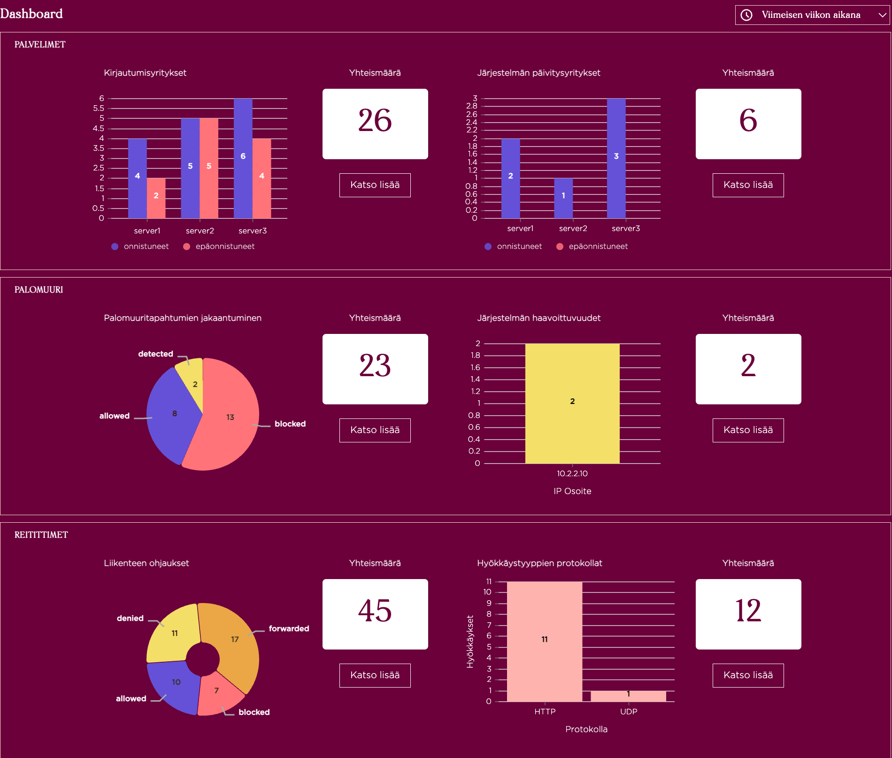

# Security Operations Center (SOC) Dashboard 

## Johdanto
Tämä on opiskeluprojekti pienessä opiskelijaryhmässä.
Projektin tavoitteena on kehittää Security Operations Center (SOC) Dashboard -sovellus, joka tarjoaa käyttäjille visuaalisen yleiskuvan organisaation tietoturvasta. 

## Projektin tavoite
Sovellus kerää, analysoi ja esittää lokidataa ja muita turvallisuushälytyksiä selkeässä muodossa, mahdollistaen SOC-tiimille nopean tietoturva-uhkien havaitsemisen ja niihin reagoimisen.
Projektin tavoitteena on tarjota tehokas työkalu organisaation tietoturvauhkien valvontaan ja niihin reagoimiseen. Se vastaa haasteeseen, jossa suuren määrän lokidataa ja hälytyksiä käsitellään, mikä voi olla aikaa vievää ja resurssienkuluttavaa. Sovellus auttaa tunnistamaan tietoturvahyökkäykset, poikkeamat normaalista käyttäytymisestä ja muut uhat nopeasti ja tehokkaasti.

## Kenelle projekti on suunnattu?
Projekti on suunnattu Business Collegen Kyberlaboratorioon, jota suunnitellaan käytettäväksi kyberturvallisuuskoulutuksessa tarjoten käytännön kokemuksia erilaisista tietoturvaongelmista ja -ratkaisuista.

## Käytetyt teknologiat
Projektissa käytetään erilaisia teknologioita, kuten:
- Vite-kehitysympäristö
- React-kirjasto käyttöliittymän toteuttamiseen
- Nivo-kirjasto datan visualisointiin
- DayJs päivämäärien käsittelyyn
- Microsoft Azuren pilvipalvelu ja Docker-containerin käyttöön mock-palvelimen ajamiseen

## Demo- ja/tai live-sivun linkit
[See SOC Dashboard](https://cameaann.github.io/soc-dashboard/)

## Visuaalinen esimerkki

## Lähteet
Projekti saa inspiraatiota olemassa olevista SOC Dashboard -ratkaisuista sekä tietoturvan parhaista käytännöistä ja suosituksista.

## Tekijät ja erottelu kuka vastasi mistäkin
Projekti on toteutettu Annan, Nargesin ja Noomin toimesta.
- Anna on toteuttanut Server-komponentin, Logs-komponentin, toteuttanut Filter-toiminnallisuuden datan suodattamiseksi ajankohdan perusteella sekä huolehtinut tyylistä ja responsiivisuudesta.
- Narges on toteuttanut Firewall-komponentin, osallistunut Filter-toiminnallisuuden toteutukseen ja luonut räätälöidyn teeman kaavioille.
- Noomi on toteuttanut Router-komponentin.

