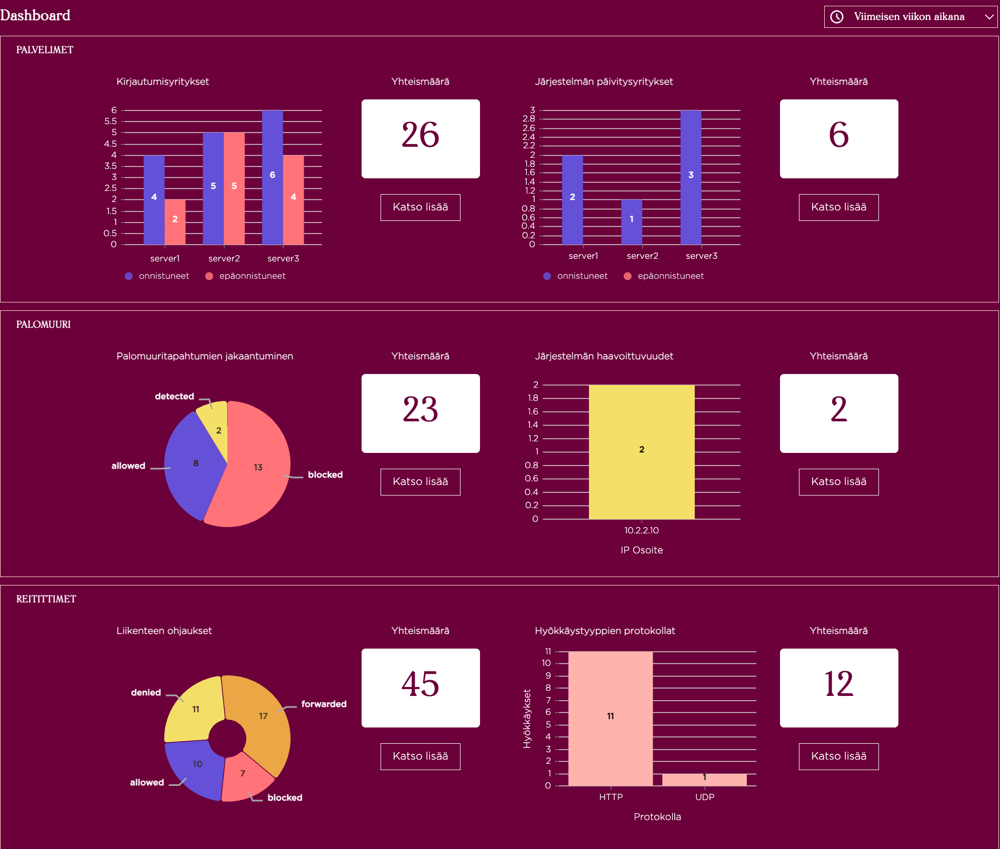

[(Read in Finnish)](https://github.com/cameaann/soc-dashboard/blob/main/README.fi.md)

# Security Operations Center (SOC) Dashboard 

## Introduction 

This is a studying project of a small group of students.
Security Operations Center (SOC) Dashboard provides users with a visual overview of the organization's security status.

## The project's goal

The application receives, analyzes, and presents log data and security alerts in a visual dashboard, enabling the SOC team to detect and respond to security threats.
SOC Dashboard aims to provide an effective tool for monitoring and responding to security threats within an organization. It addresses the challenge of handling a large volume of log data and alerts, which can be time-consuming and resource-intensive. The application helps to quickly and efficiently identify security breaches, deviations from normal behavior, and other threats.

## Who is the project aimed at?
The project is aimed at the Cyber Laboratory within Business College, intended for use in cybersecurity education. It is designed to offer practical experience with a range of information security issues and solutions.

## Technologies used:

The project utilizes various technologies, including:
- Vite development environment
- React library for implementing the user interface
- Nivo library for visualizing data
- DayJs for working with dates
- Microsoft Azure cloud and Docker container for running a mock server

## Demo and/or live page links

[See SOC Dashboard](https://cameaann.github.io/soc-dashboard/)

## Visual example

## Sources
The project draws inspiration from existing SOC Dashboard solutions as well as best practices and recommendations in the field of cybersecurity.

## Contributors and delineation of responsibilities
The project is implemented by Anna Shestakova, Narges Ghanbari and Noomi Kykkänen.
- Anna has implemented the Server component, Logs component, implemented the Filter functionality to filter data by time, and handled styles and responsiveness. 
- Narges has implemented the Firewall component, contributed to the implementation of the Filter functionality, and created a custom theme for charts.
- Noomi has implemented the Router component.
